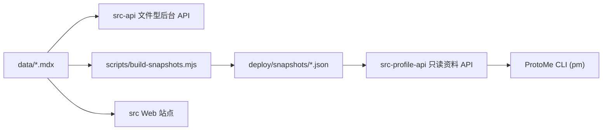

# ProtoMe

ProtoMe 是一个面向独立创作者、技术专家与知识工作者的 AI Native 个人品牌基础设施。

当前这个公开仓库默认分发的是一套 **example 模板**：
包含示例内容、示例品牌资源、示例 RSS / 搜索产物，以及完整的私有工作区接入能力。

如果你要正式使用 ProtoMe，推荐把真实的个人资料、项目、工作记录和图片资源放到
`PROTOME_CONTENT_WORKSPACE` 指向的私有工作区里，而不是继续保留在公开仓库的 `data/` 与 `public/` 中。

换句话说，这个仓库现在更像是：

- 一套可公开分享的个人品牌基础设施模板
- 一套支持 Agent 消费内容上下文的站点与资料系统
- 一套“公开骨架 + 私有内容”的本地优先工作流

## 为什么这不是传统博客模板

在 AI 时代，真正有价值的已经不只是“发布内容”，而是让你的经验、项目、观点、方法论与
专业身份能够被 Agent 理解、调用、引用与传播。

传统博客模板解决的是“网页展示”问题，而 ProtoMe 试图解决的是“个人品牌如何成为
机器可理解、可协作、可扩散的资产基础设施”。

ProtoMe 与传统博客最大的区别在于：

- 它不仅管理页面内容，更管理个人能力、项目经历、工作轨迹与专业表达
- 它不仅面向读者展示，也面向 Agent、自动化流程与未来的智能分发网络提供上下文
- 它把个人数据资产沉淀为结构化快照，使个人品牌不再只是网页内容，而是可被机器理解的专业语义层
- 它把内容站点、后台、只读 API 与 CLI 放在同一个体系中，让“展示层”“资料层”“传播层”形成闭环
- 它强调云端暴露的是受控只读能力，而不是原始写权限，从而更适合构建可信、稳定、可长期演进的个人品牌底座

因此，ProtoMe 更适合被理解为：

一个为 AI 时代打造的个人品牌基础设施。

它的目标不是只帮你搭一个站，而是帮助你把个人数据、专业履历、内容资产与思考体系，
转化为能够被 Agent 持续放大、连接与传播的长期价值网络。

## 项目定位

ProtoMe 当前由四层能力组成：

1. Web 站点
   基于 Next.js 15、React 19、Tailwind CSS 4 和 Contentlayer，负责公开内容展示。
2. 文件型后台
   通过独立的管理 API 直接读写 `data/` 下的 MDX 内容与图片资源。
3. 只读 Profile API
   将本地资料构建为结构化快照，对外提供只读访问接口。
4. ProtoMe CLI
   通过单一访问密钥读取云端资料，用于 Agent、脚本或终端查询。

这套设计的核心思想是：

- 内容源始终保留在本地文件系统
- 后台编辑直接面向 MDX 与静态资源
- 云端只暴露只读快照，而不是原始写入能力
- CLI 只负责读取，不承担同步、部署和写入职责

## 公开仓库说明

- `data/` 中现在默认是 example 内容模板，方便 fork / clone 后直接理解结构
- `public/` 中默认是 example 品牌资源与示例生成产物，不再承载真实个人资料
- 真实内容建议维护在 `.protome-workspace/` 或你自定义的私有目录中
- 站点、快照构建、后台 API 与 Profile API 都已经支持 `PROTOME_CONTENT_WORKSPACE`

## 核心特性

- 基于文件系统的内容模型，博客、项目、作者、Profile、About、Worklog 全部支持从私有工作区读取
- 独立后台管理接口，支持内容创建、更新、删除、上传资源与发布
- 统一的管理端内容模型，支持集合型内容和单例型内容
- 构建期生成资料快照，形成 `profile.json`、`projects.json`、`context.json`
- 独立只读资料 API，适合 Agent、自动化脚本或轻量客户端消费
- CLI 支持 endpoint 与 access key 配置、鉴权校验、Profile/Project/Context 查询
- 站点仍保留博客站点应有能力：MDX、标签、RSS、SEO、评论、订阅、项目页、工作记录页

## 适合的使用场景

- 作为个人主页与技术博客
- 作为本地优先的个人资料中台
- 作为 AI Agent 的只读上下文源
- 作为“内容站点 + 资料 API + 终端客户端”一体化工作区

## 技术栈

- Web：Next.js 15、React 19、TypeScript、Tailwind CSS 4、Contentlayer2、Pliny
- 后端：Express 5、Zod、dotenv、multer
- CLI：TypeScript、Node.js ESM
- 工具链：pnpm workspace、ESLint、Prettier、Husky、lint-staged

## 工作区结构

```text
.
├─ src/                    # Web 站点（Next.js App Router）
├─ src-api/                # 文件型后台管理 API
├─ src-profile-api/        # 只读资料 API
├─ packages/protome-cli/   # 命令行客户端，发布后命令名为 pm
├─ data/                   # 公开 example 内容模板
├─ public/                 # 公开 example 静态资源与生成产物
├─ scripts/                # 快照构建、发布、校验、云端启动脚本
└─ deploy/                 # Docker 与快照产物目录
```

### `data/` 中当前内容类型

- `data/profile/`
  示例 Profile 内容源
- `data/about/`
  示例 About 页面内容
- `data/blog/`
  博客文章
- `data/projects/`
  示例项目档案
- `data/worklogs/`
  示例工作记录
- `data/authors/`
  示例作者资料
- `data/system/`
  面向快照与 Agent 的系统上下文，例如博客风格、工作重点

## 架构关系



## 主要功能说明

### 1. Web 站点

Web 站点位于 `src/`，当前包含这些主要页面：

- `/`
- `/about`
- `/profile`
- `/projects`
- `/blog`
- `/worklogs`
- `/admin`

站点保留了成熟博客系统能力，并结合项目自身的数据模型进行了扩展：

- MDX 内容渲染
- 标签页与分类组织
- RSS 与 sitemap
- 评论系统
- 邮件订阅
- 项目与工作记录页面
- 后台管理入口

### 2. 文件型后台管理 API

后台 API 位于 `src-api/`，负责：

- 读取内容类型与内容列表
- 创建和编辑内容
- 删除集合型内容
- 上传内容资源图片
- 触发发布流程
- 管理发布状态

它直接面向内容工作区中的 `data/` 与 `public/static/images/` 工作，因此后台修改最终都会落到
文件系统中，而不是数据库中。

### 3. 只读 Profile API

只读资料 API 位于 `src-profile-api/`，依赖快照文件工作。

当前快照构建脚本会生成：

- `deploy/snapshots/profile.json`
- `deploy/snapshots/projects.json`
- `deploy/snapshots/context.json`
- `deploy/snapshots/manifest.json`

对外提供的接口包括：

- `GET /health`
- `GET /v1/auth/verify`
- `GET /v1/profile`
- `GET /v1/projects`
- `GET /v1/projects/:id`
- `GET /v1/context`

这些接口要求通过 Bearer Token 鉴权，用于保证云端只读访问边界清晰。

### 4. ProtoMe CLI

CLI 位于 `packages/protome-cli/`，打包后命令名为 `pm`。

当前支持的命令包括：

```bash
pm key set <key>
pm key show
pm key clear
pm endpoint set <url>
pm endpoint show
pm auth verify [--json]
pm whoami [--json]
pm profile get [--json]
pm project list [--json]
pm project get <id> [--json]
pm context [--json]
```

CLI 只负责读取远端只读资料 API，不负责部署、同步或内容写入。

## 快速开始

### 1. 安装依赖

```bash
pnpm install
```

### 2. 准备环境变量

建议将真实密钥配置写入 `.env.local`：

```bash
cp .env.example .env.local
```

如果你希望将个人资料、项目、工作记录和品牌资源放到私有工作区，而不是继续放在公开仓库内，可以先初始化一个私有内容工作区：

```bash
pnpm protome init-workspace --dir ".protome-workspace" --with-examples --write-env
```

这条命令会：

- 自动创建私有 `data/` 与 `public/` 的标准目录结构
- 可选写入最小示例内容
- 将 `PROTOME_CONTENT_WORKSPACE` 写入 `.env.local`

重点变量说明：

- 私有内容工作区（可选）
  - `PROTOME_CONTENT_WORKSPACE`
- 后台管理必需
  - `NEXT_PUBLIC_ADMIN_API_BASE_URL`
  - `PROTOME_ADMIN_API_PORT`
  - `ADMIN_APP_ORIGIN`
  - `PROTOME_ADMIN_KEY`
  - `PROTOME_PUBLISH_RESTART_CMD`
- 评论功能可选
  - `NEXT_PUBLIC_GISCUS_REPO`
  - `NEXT_PUBLIC_GISCUS_REPOSITORY_ID`
  - `NEXT_PUBLIC_GISCUS_CATEGORY`
  - `NEXT_PUBLIC_GISCUS_CATEGORY_ID`
- 订阅功能可选
  - `BUTTONDOWN_API_KEY`
- 云端只读 Profile API 可选
  - `PROTOME_PROFILE_API_PORT`
  - `PROFILE_API_ORIGIN`
  - `PROFILE_API_SNAPSHOT_DIR`
  - `PROTOME_PROFILE_API_ACCESS_KEY`

### 3. 启动常见开发场景

仅启动站点前端：

```bash
pnpm dev
```

启动后台管理 API：

```bash
pnpm dev:api
```

启动只读 Profile API：

```bash
pnpm dev:profile-api
```

同时启动 Web 与后台管理 API：

```bash
pnpm dev:workspace
```

默认端口：

- Web：`3000`
- 管理 API：`4100`
- Profile API：`4200`

## 推荐开发流程

### 内容站点开发

适合修改页面样式、内容布局、MDX 组件或公开页面时使用：

```bash
pnpm dev
```

### 文件型后台开发

适合开发 `/admin` 内容后台、调试后台接口时使用：

```bash
pnpm protome init-workspace --dir ".protome-workspace" --write-env
pnpm dev
pnpm dev:api
```

访问：

- Web：`http://localhost:3000`
- 后台：`http://localhost:3000/admin`

### 只读资料 API 开发

适合调试快照、Agent 数据接口或 CLI 访问链路时使用：

```bash
pnpm protome init-workspace --dir ".protome-workspace" --write-env
pnpm build:snapshots
pnpm dev:profile-api
```

## 构建与运行

### 常用构建命令

构建站点：

```bash
pnpm build
```

构建后台管理 API：

```bash
pnpm build:api
```

构建只读 Profile API：

```bash
pnpm build:profile-api
```

生成资料快照：

```bash
pnpm build:snapshots
```

构建云端只读运行产物：

```bash
pnpm build:cloud
```

构建整个工作区：

```bash
pnpm build:all
```

### 云端只读运行

`build:cloud` 的职责是：

- 构建 Web 站点
- 构建 `src-profile-api`
- 生成快照文件

随后通过下面命令启动云端只读运行时：

```bash
pnpm serve:cloud
```

它会同时启动：

- Next.js 站点
- Profile API

### Docker 运行

仓库内已经提供 Dockerfile：

```bash
docker build -f deploy/docker/Dockerfile -t protome-cloud:v1.0.0 .
```

运行时建议显式注入 Profile API Key：

```bash
docker run -d \
  -p 3300:3000 \
  -p 4300:4200 \
  -e PROTOME_PROFILE_API_ACCESS_KEY=your-profile-api-access-key \
  -e PROFILE_API_ORIGIN=http://localhost:3300 \
  protome-cloud:test
```

注意：

- `PROTOME_PROFILE_API_ACCESS_KEY` 是运行时环境变量，不是打包时写死
- 如启用了 `PROTOME_CONTENT_WORKSPACE`，本地构建快照时会优先从该私有工作区读取 `data/` 与 `public/`
- 开发环境未配置时，`src-profile-api` 会回退到默认开发 Key
- 生产环境未配置时，`src-profile-api` 会直接报错退出

## CLI 使用示例

### 配置云端 endpoint

```bash
pm endpoint set http://127.0.0.1:4200
```

### 配置 access key

```bash
pm key set your-profile-api-access-key
```

### 校验鉴权

```bash
pm auth verify
```

### 获取 profile

```bash
pm profile get
```

### 获取项目列表

```bash
pm project list
```

### 获取上下文

```bash
pm context
```

如果需要结构化输出，可加 `--json`。

## 发布链路

后台 API 的发布接口最终会触发 `scripts/publish.mjs`，流程包括：

1. 执行内容校验
2. 构建站点
3. 根据 `PROTOME_PUBLISH_RESTART_CMD` 执行重启命令

相关脚本：

- `scripts/validate-content.mjs`
- `scripts/publish.mjs`
- `scripts/postbuild.mjs`
- `scripts/rss.mjs`

## 质量保障

Lint：

```bash
pnpm lint
```

类型检查：

```bash
pnpm typecheck
```

当前工作区采用：

- ESLint
- Prettier
- Husky
- lint-staged

## 目录速查

- [src](./src)
  Web 站点
- [src-api](./src-api)
  文件型后台管理 API
- [src-profile-api](./src-profile-api)
  只读资料 API
- [packages/protome-cli](./packages/protome-cli)
  CLI
- [data](./data)
  内容源
- [scripts](./scripts)
  构建与发布脚本
- [deploy/docker/Dockerfile](./deploy/docker/Dockerfile)
  Docker 构建入口
- [openspec](./openspec)
  设计与变更提案

## 后续建议

- 将根级 `.env` 中的敏感配置逐步迁移到 `.env.local`
- 为 Docker / 云平台补一份正式部署文档
- 为 CLI 增加安装、打包和发布说明
- 为 Profile API 补充鉴权与错误码文档
